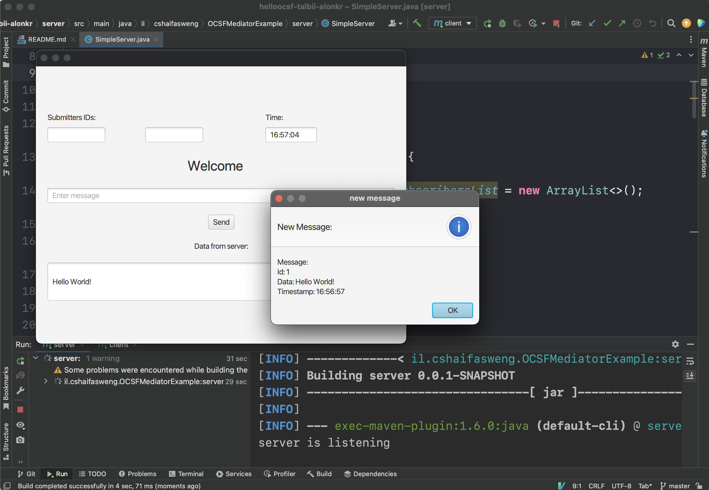
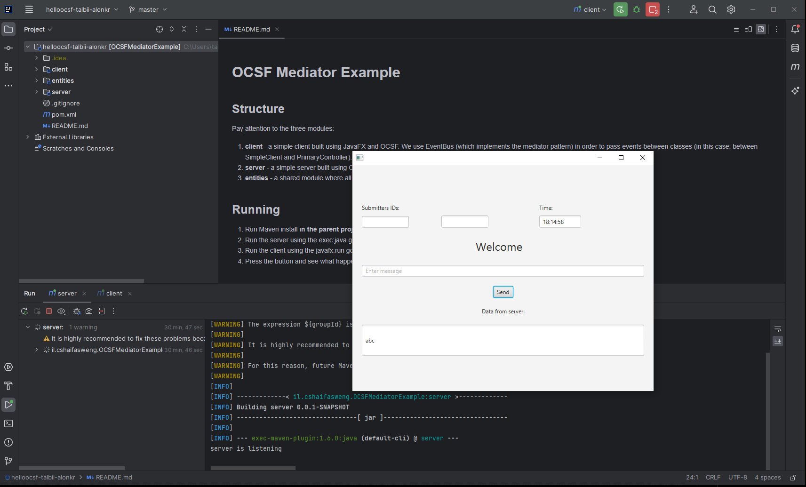
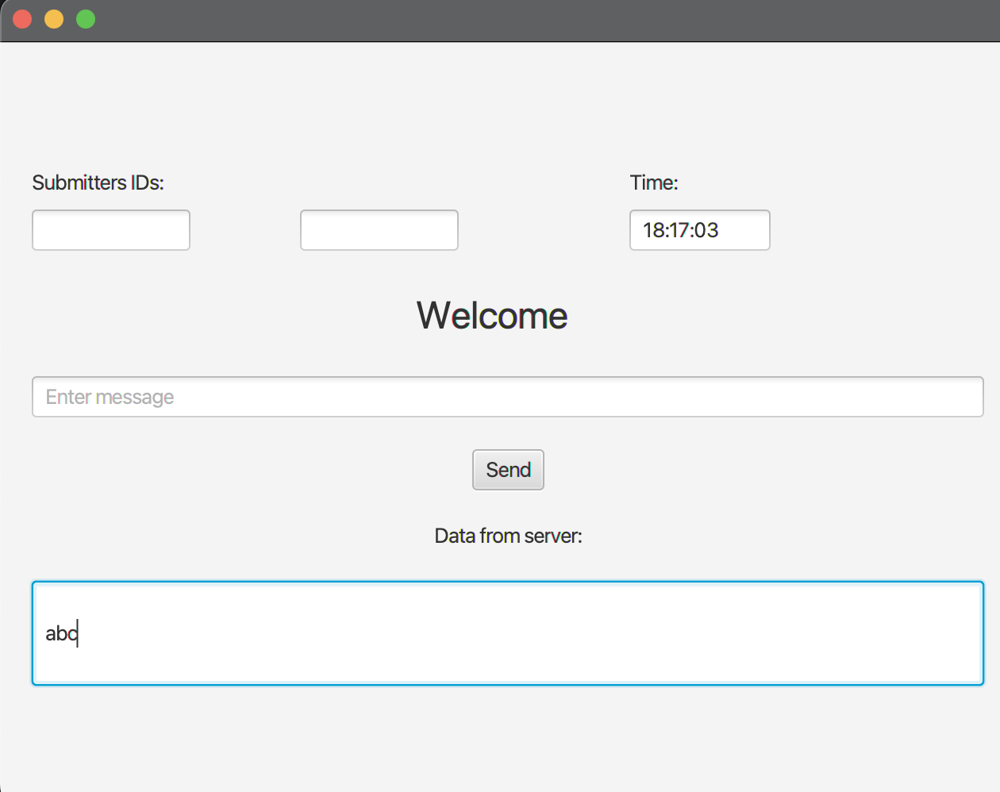
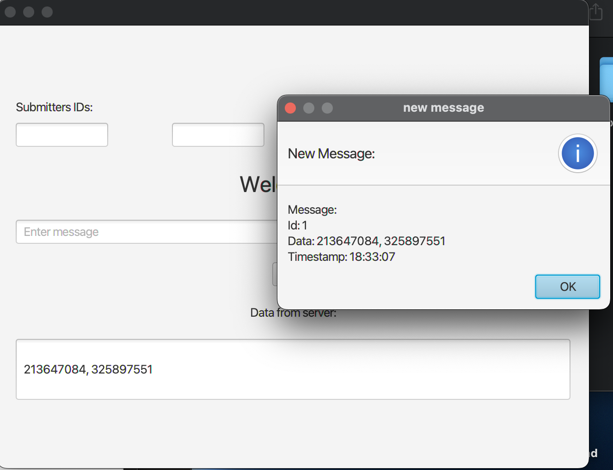
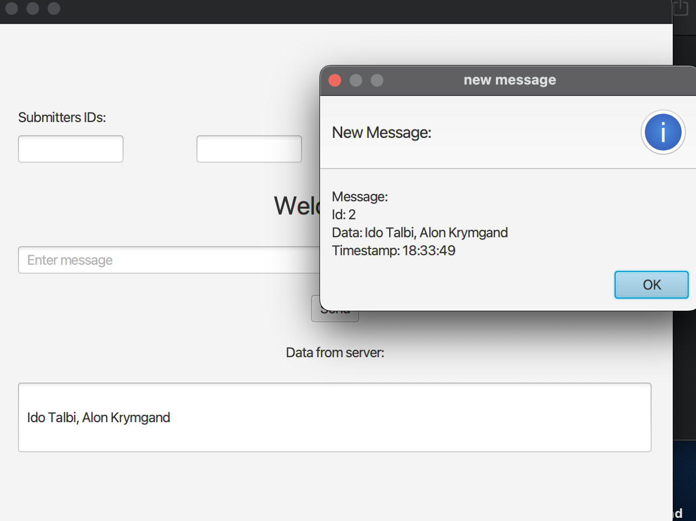
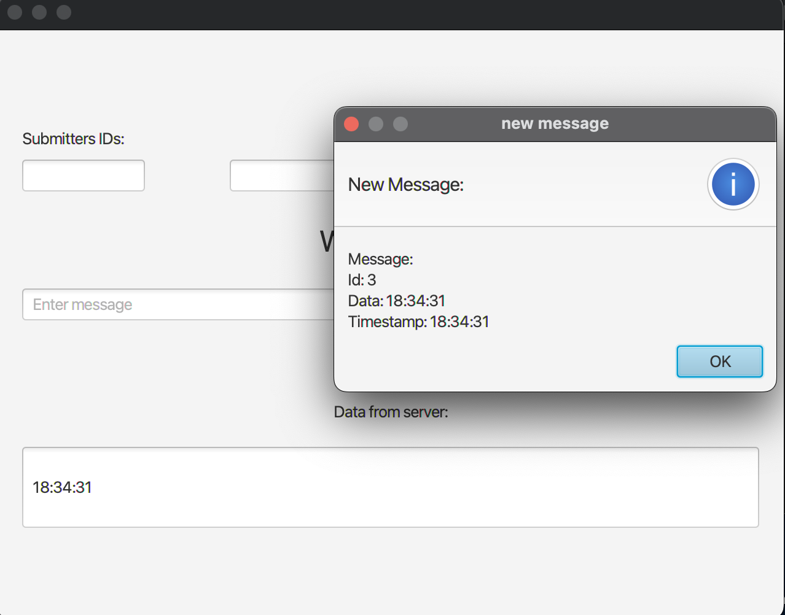
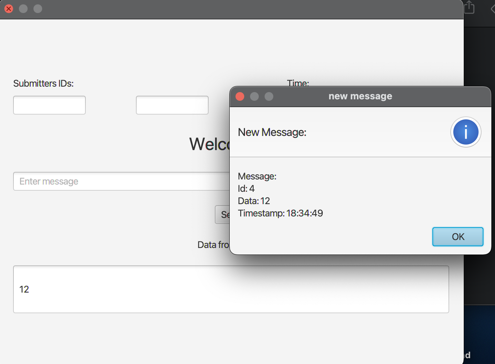
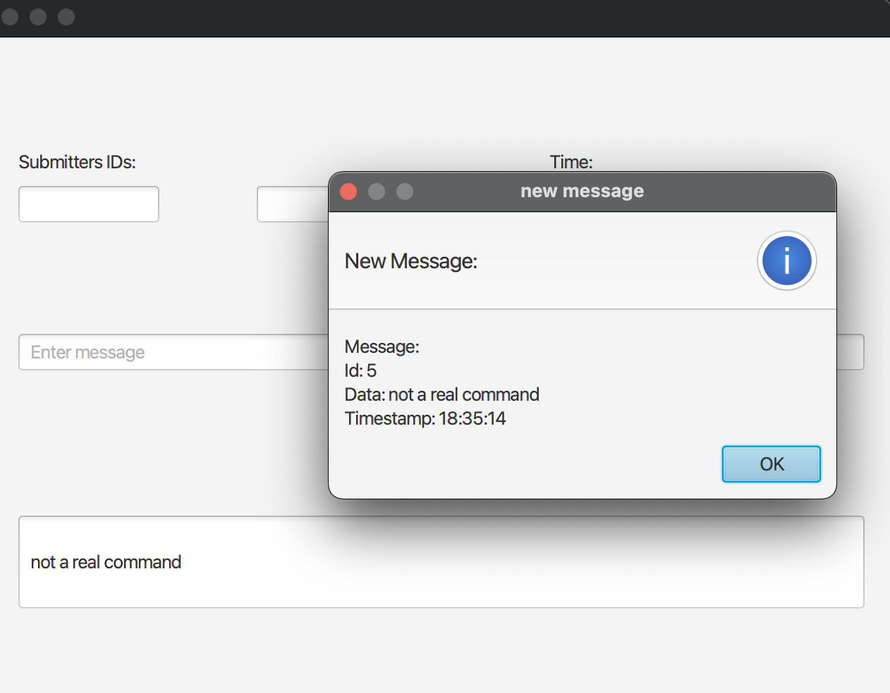
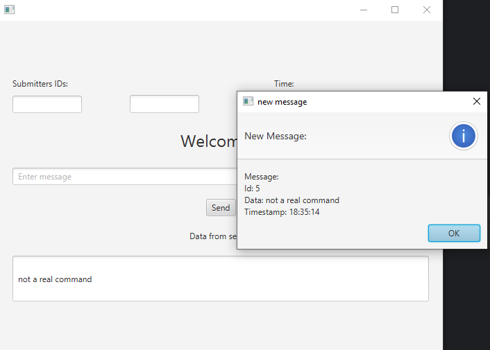

# Lab 5: OCSF and EventBus

Submitted by:
- Ido Talbi (213647084)
- Alon Krymgand (325897551)

Link to repository: [helloocsf-talbii-alonkr](https://github.com/SWEng-Tutorial/helloocsf-talbii-alonkr).

---

## 3a: Running on a single computer

Below is a picture of running both the server and client on a laptop:

  

\newpage
## 3b: Running on two computers

-----------

**IMPORTANT NOTICE**

While reviewing the code, we noticed that the program's arguments (both the server and client) seem to be hard-coded -- i.e., the server always listens to port $3000$ and the client always connects to $\texttt{localhost}:3000$, thus making running two different computers **not** possible.

In order to fix this, while running on two computers we instead hard-coded different values. <u> We did not fix this! </u> The lab did not request a fix for this, but this is something we thought is important to know.

----------

Below are two pictures, running the server on a PC and the client on a laptop:

 

\newpage
## 4: Server commands

**Note:** we ran the tests on the two-computer configuration.

\newpage
## send Submitters IDs

Response sent back only to initiating client.

\newpage
## send Submitters

Response sent back only to initiating client.

\newpage
## what's the time?

Response sent back only to initiating client.

\newpage
## multiply `n*m`

Response sent back only to initiating client. Command used: `multiply 3*4`.

\newpage
## Any other command

Response send back to all other connected clients. If the message $M$ is sent, it is sent back to all clients (including the initiating one). Command used: `not a real command`.

